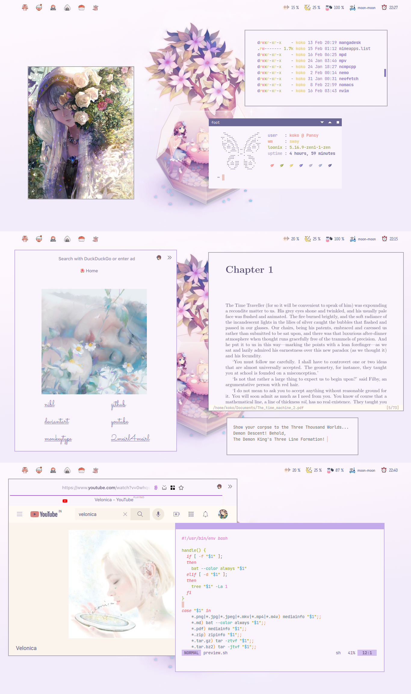

<h1>My Crappy Dotfiles :)</h1>
<h3> Cinnamonroll: </h3>

<h3> Moon: </h3>

 
. moved moon dots to old-moon branch 
. moved gruvbox dots to gruvbox branch 

special thanks to: 
- [Gwynsav](https://github.com/Gwynsav/gwileful), for the gwileful config 
- [Stardust](https://github.com/Stardust-kyun/dotfiles), used their config as reference for  some stuff 
- [Nekonako](https://github.com/nekonako/dotfiles), literally learnt how to make widgets using their config :3 